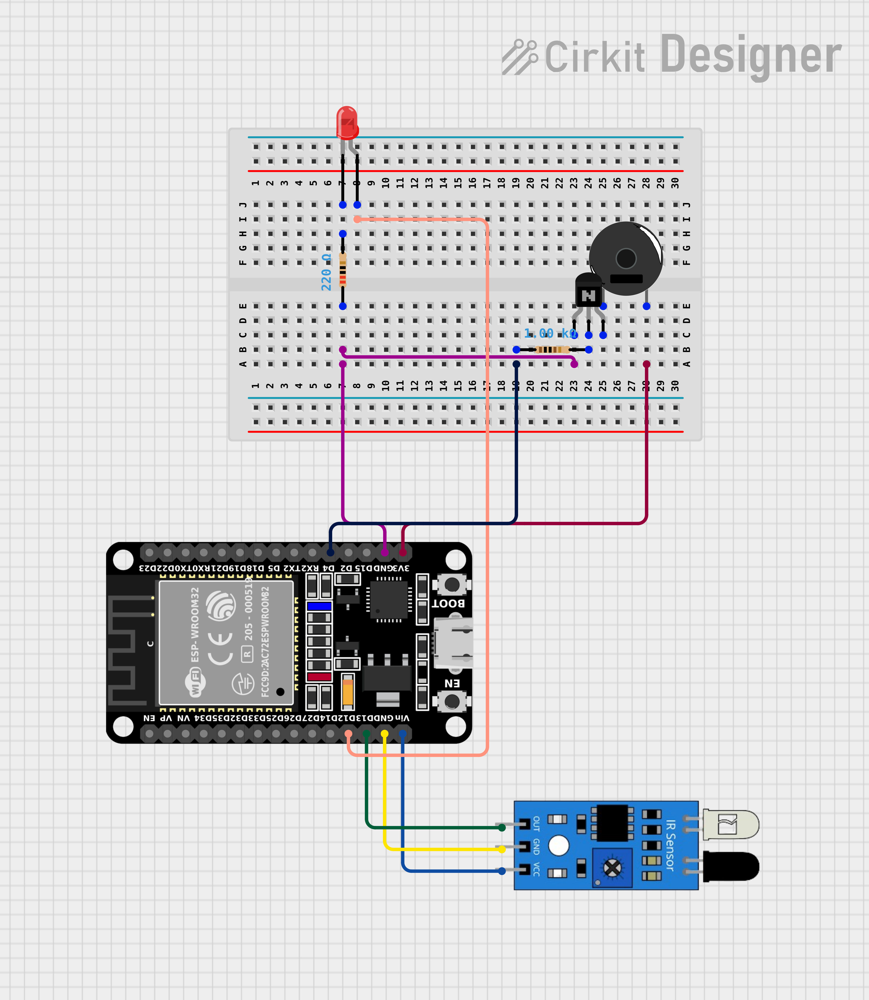
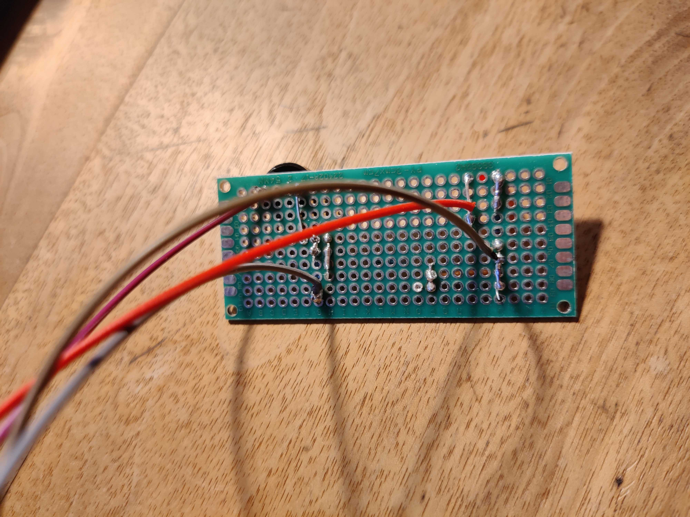
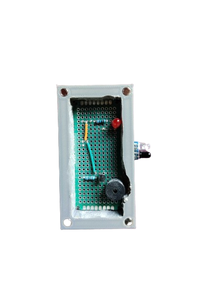

# Simple Motion Sensor ESP32 Buzzer with LED indicators

I designed a simple buzzer with a red LED indicators and motion sensor. It is intended to light up RED when a motion is detected, with a buzzing sound.

**WARNING**: This is a very low tolerance build and ultimately requires some improvements. You will need to file the PCB edges to fit it in and remove some elements of the 3D print to fit everything inside.

## Resources

- [ESP32 board by diymore ](https://www.amazon.fr/dp/B0BS6R68H6?psc=1&ref=ppx_yo2ov_dt_b_product_details)
- Active buzzer (the standard cylindrical arduino version will do)
- Red LED x1
- Motion sensor x 1
- 220-ohm resistor x 1
- 1K-ohm resistor x 1
- 2N2222A transistor x 1 (NPN)
- Jumper wires and breadboard

If you plan on soldering the final project:

- [a 3x7 cm PCB](!https://www.amazon.fr/gp/product/B073W78G8J/ref=ppx_yo_dt_b_search_asin_title?ie=UTF8&psc=1)
- a soldering iron and soldering material

For the 3D printed design:

- [5x3mm magnets x 4](!https://www.amazon.fr/gp/product/B0C9WQYZ27/ref=ppx_yo_dt_b_search_asin_title?ie=UTF8&psc=1)
- female to male jumper cables (we will cut the ends to connect to the PCB)
- SUNLU PLA
- Cutters (small sizes)
- Filing tools

## 3D case design considerations

The buzzer is intended for indoor use, we therefore do not need a waterproof design.
 
However, we needed a design:

- that made the RED led visible.
- that did not obstruct the sound from the buzzer.
- that hid the ESP32 board.
- that left enough space for a long charging cable if necessary.
- that was small enough to be discreet and stick around a door.
- that did not obstruct the IR sensors but hid the connected board.
- where the ESP32 board would be placed upside down in order to have the GPIO pins facing upwards, the PCB board facing downwards (to avoid cabled going in every direction, particularly over the PCB). The length of the cables might be an issue, but we could tidy them up afterwards with cable holders or by shortening them, soldering the ends and covering them with thermal duct.
- with an accessible lid: the calibration of the distance of the IR sensor should be flexible, based on where the final project is placed.
- with a removable lid: using magnets should keep the lid closed if the case ends up being upside down.
- with a modular place for the sensor for flexibility
- with a modular place for the esp32 board rotation for flexibility

This time I decided to use Blender to design the case. Although Fusion 360 is a better tool solution for this kind of low-tolerance build, my experience with that tool wasn't sufficient to get a quick prototype working.

The original sketches are available below.

## 3D Printing instructions

The files to 3D print are available in `.stl` format in the "3d" folder. There are two parts to this print: the main case and the lid.

I printed the case in PLA but it can easily be printed in ABS or PETG too. The below settings apply to PLA (from SUNLU).

The lid should be printed with the holes facing upwards to avoid having to fill them and remove the supports.

Infill: 20%  
Print speed: 80mm/s  
Support pattern: Gyroid  
Support: everywhere, line pattern  
Nozzle temperature: 210 degrees Celsius  
Bed temperature: 60 degrees Celsius  

Removing the supports once the print is completed can be tricky, I recommend you start with the outside-facing supports and move inwards.

The total print time was 8h24m with approximately 82g (Cura slicer indicator) of filament.

## Wiring

Wiring the ESP32 to the IR Sensor:

_ESP32 -> IR Sensor_
 
D13 -> OUT
 
GND -> GND
 
VIN -> VCC
 

Wiring the LED and Active buzzer to the ESP32:

 
The are only 2 GND GPIO pins on the ESP32 board, we therefore have to share one between the LED and the buzzer.

This is the prototype version of the circuit before it was soldered together on a PCB.

**NOTE: you can calibrate the sensitivity of the IR sensor by turning the blue trim-post distance adjuster**

Below is the soldered PCB version for reference. I did not solder the connections to the ESP32 GPIOs or the IR sensor GPIOs.

## Assembly

This first version is a very low tolerance build and ultimately it is too tight.

Below are the post-print modifications and assembly instructions:

1. Remove the supports, starting from the IR sensor holes, then the sides and finally the supports for the IR sensor holders.It is a little tricky, I recommend you use a cutter and some prodding tools.
2. Cut one of the IR sensor holders inside the case. There isn't enough room to slide the ESP32 into place with both of them.
3. File the inside of the case, for each side where the PCB board will be placed. I forgot the extra space for the buzzer in the first version, you will need to file some extra for that part. Alternatively, you can simply file the extra space for the buzzer and file the PCB itself rather than the case.
4. Place the ESP32 board inside the case, placing it carefully over two pins. The top part of the pins is too thick (3mm) in the first version, you won't be able to place it perfectly.
5. Slide the IR sensor into place. You may need to apply some gently pressure to have it evenly placed inside the hole.
6. Place the PCB tightly inside the case, all the way down to the holders.
7. Place the magnets, insuring you keep track of their polarity. You may need to apply some pressure to push them in there, it is a tight fit.
8. Plug the ESP32 board and you're done !

## Software

The software is quite straightforward, it will:

At setup:

- Initialise the onboard LED
- Initialise the red LED
- Initialise the buzzer pin

On a loop:

- Turn the onboard led on
- Read the IR sensor data
- If there is a proximity (value 0) reading, turn the red LED on and activate the buzzer
- If there is NO proximity (value 1) reading, turn the red LED off and deactivate the buzzer
- Turn the onboard led off
- Wait 1 second

_There are comments in the code to help explain the key elements_

## Future improvements

- Rounded edges for the case (the current topology has to be updated, the bevel should have been applied before setting holes in the base structure)
- Remove one holder for the IR sensor and fill in order to only have one side for the IR sensor
- Do the same for the hole for the ESP32 power cable
- Improve the tolerance of the overall piece, preferably by 2mm (i.e inside wider by 2mm on each side, the holes should be wider by 1mm on each side)
- Increase the size of the holes (see above)
- Optionally, create a side lid (with magnets), to make it easier to remove the supports
- Add holes on the lid to show the LED and buzzer

-

- Improve the overall design of the case, preferable using software like Fusion 360.

## Useful links

- [ESP32 Buzzer](https://www.youtube.com/watch?v=TcH8Bx9yC7Q)
- [2N222A datasheet](https://components101.com/transistors/2n2222a-pinout-equivalent-datasheet)
- [IR Sensor and ESP32](https://techatronic.com/ir-sensor/)
